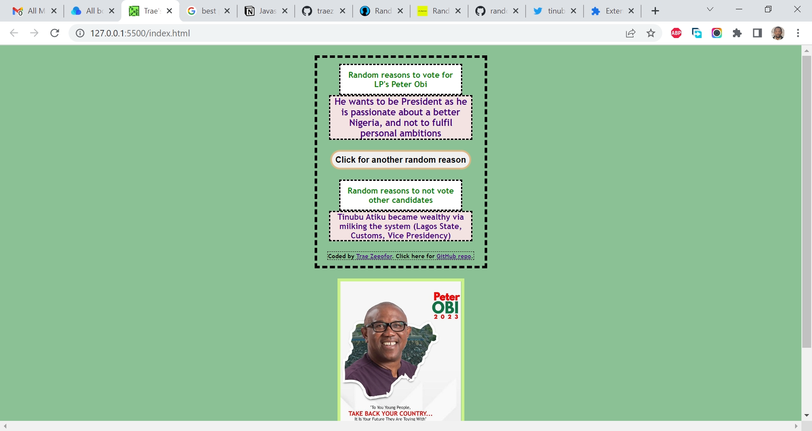

# Section.io - Random reasons OOP JavaScript Project on JS Beginners

This is a solution to the [Random Joke JavaScript AJAX Project](https://jsbeginners.com/random-joke-javascript-ajax-project/). I am trying to improve my coding skills by building realistic projects. 

## Table of contents

- [Overview](#overview)
  - [The challenge](#the-challenge)
  - [Screenshot](#screenshot)
  - [Links](#links)
  - [My process](#my-process)
  - [Built with](#built-with)
  - [What I learned](#what-i-learned)
  - [Continued development](#continued-development)
  - [Useful resources](#useful-resources)
  - [Author](#author)
  - [Acknowledgments](#acknowledgments)

## Overview

### The challenge

The objective of this JavaScript AJAX project is to use the Chuck Norris API to retrieve a random joke, and then output it to the DOM. 

### Screenshot

### Links

- Solution URL: [https://github.com/traez/random-reasons-oop-javascript-project](https://github.com/traez/random-reasons-oop-javascript-project)
- Live Site URL: [https://traez.github.io/random-reasons-oop-javascript-project/](https://traez.github.io/random-reasons-oop-javascript-project/)

## My process

### Built with

- Semantic HTML5 markup
- CSS custom properties
- Flexbox
- CSS Grid
- Mobile-first workflow
- Vanilla JavaScript

### What I learned

A very catchy and apt project for the Nigerian Dec 2022 political season.    
Didn't quite use an API to fetch the random; hosted it directly via Objects.  
But learning about APIs is next on my ToDo list.  

### Continued development

A very catchy and apt project for the Nigerian Dec 2022 political season.    
Didn't quite use an API to fetch the random; hosted it directly via Objects.  
But learning about APIs is next on my ToDo list.     

### Useful resources

Stackoverflow  
MDN Web Docs  
w3schools  
YouTube  
Google  
ChatGPT OpenAI chatbot  

## Author

- Website - [Trae Zeeofor](https://github.com/traez)  
- Twitter - [@trae_z](https://twitter.com/trae_z) 

## Acknowledgments

To all those who believe in the Nigerian (Tech) dream  
